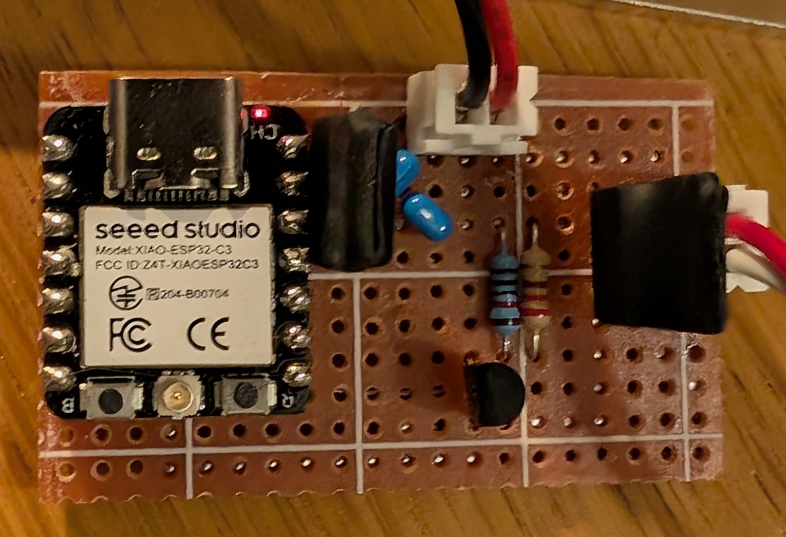

# May 16th: Did a protoboard prototype!
I wanted to test if the idea I had would work, so I made a prototype on a protoboard. 
First, I used a XIAO ESP32C3, a few resistors and a Power Mosfet IRLZ34N. The leds didn't completely work, but I found out it was because I wasn't fully saturating the mosfet.
To fix it, I use a BS170 to drive the IRLZ34N. I'm not sure if the BS170 fully saturates. That's why I connected it to 24V (input) so it would saturate the IRLZ34N.

**Total time spent: 6h**

# May 17th: Convert the design to perfboard
I now had a working prototype, so I wanted to convert it to a perfboard design.
I used KiCad to design the schematic so I would have a better overview of the connections. (I still messed up a few connections, but I fixed them later.)
I added a few extra components, like a 5V regulator so I could power the ESP32C3 from the 24V input, and a few capacitors to filter the power supply.

I also designed a case for the perfboard, so I could start using it.

**Total time spent: 10h**

# May 18th: Did a PCB!
Now I had everything I needed to start my PCB design.
I used KiCad to design the PCB, reusing most of the schematic I used with the perfboard. I did most of the components THT so they would be easier to solder.

I had to also redesign part of the case so it woukld fit the PCB.

**Total time spent: 6h**
