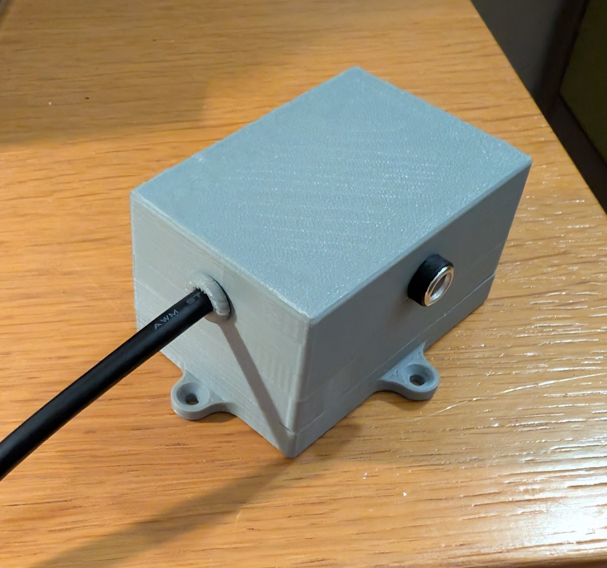
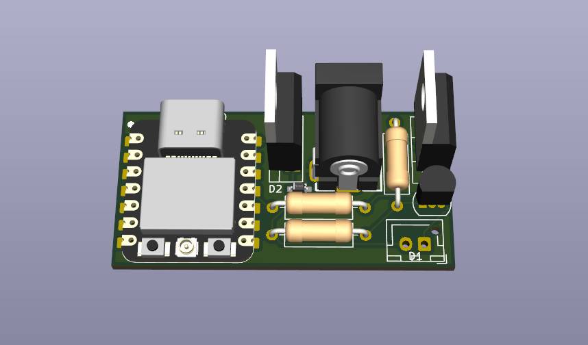

# LED Controller
A simple monochromatic LED controller for Home Assistant, powered by ESPHome on a XIAO ESP32-C3.

## Features
- Brightness control via Home Assistant UI  
- Over-the-air (OTA) updates  

## Images
<details>
  <summary>Final project</summary>

  
</details>
<details>
  <summary>Schematic</summary>

  
</details>
<details>
  <summary>PCB</summary>
  
  
  
</details>


## BOM
| Item Name           | What the item is for in your project | Item source                                                                 | Item price     | Total Price     |
|---------------------|--------------------------------------|-----------------------------------------------------------------------------|----------------|-----------------|
| JST XH connector    | Light connector                      | https://es.aliexpress.com/item/10050074608978V65.html                       | 1.22€          | 23.48€          |
| SS2040FL Diode      | Reverse polarity protection          | https://es.aliexpress.com/item/1005009042615388.html                        | 5.39€          | 26.9 USD        |
| 5.5mm jack          | PSU connector                        | https://es.aliexpress.com/item/10000000716763.html                          | 1.39€          |                 |
| BS170               | Driver for power mosfet              | https://es.aliexpress.com/item/1005007109406326.html                        | 1.44€          |                 |
| IRLZ34N             | Power Mosfet                         | https://es.aliexpress.com/item/1005007174349301.html                        | 1.90€          |                 |
| 220 Ω resistor      | Mosfet series resistor               | https://es.aliexpress.com/item/1005006750101049.html                        | 1.08€          |                 |
| 10 kΩ resistor      | Pullup resistor                      | https://es.aliexpress.com/item/1005006750101049.html                        | 1.08€          |                 |
| XIAO ESP32C3        | MCU                                  | https://es.aliexpress.com/item/1005006828136326.html                        | 8.29€          |                 |
| L7805CV             | Regulate 5V                          | https://es.aliexpress.com/item/1005004989595789.html                        | 1.69€          |                 |


## Configuration

All firmware configuration lives in [code.yaml](code.yaml):

```yaml
esphome:
  name: led-controller
  friendly_name: LED-Controller

esp32:
  board: esp32-c3-devkitm-1
  framework:
    type: arduino

logger:

api:
  encryption:
    key: "YOUR_API_ENCRYPTION_KEY"

ota:
  - platform: esphome
    password: "YOUR_OTA_PASSWORD"

wifi:
  ssid: !secret wifi_ssid
  password: !secret wifi_password
  ap:
    ssid: "Led-Controller"
    password: "FALLBACK_AP_PASSWORD"

light:
  - platform: monochromatic
    name: "Light Bar"
    output: gpio_light
    id: light_bar1
    icon: "mdi:ceiling-light"

output:
  - platform: ledc
    pin: GPIO10
    id: gpio_light
    inverted: true

captive_portal:
```